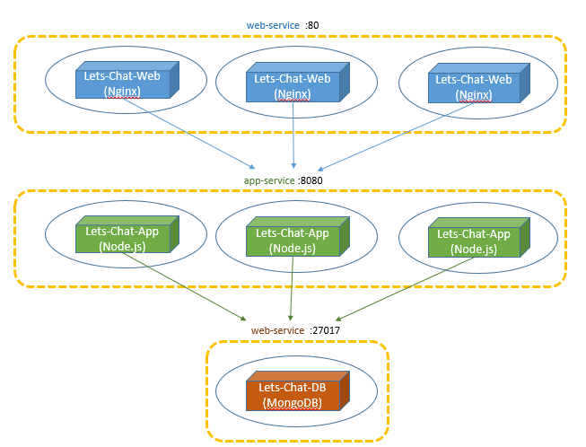

A self-hosted chat app for small teams
# K8s Training with Lets-Chat
In this training we will deploy and scale **let's chat** application on kubernetes cluster. Let's Chat is a persistent messaging application that runs on Node.js and MongoDB with Nginx at the front.

### Let's Chat Architecture

### Tasks
1.  [Deploy and Explore Lets-Chat-Web](day-1/task-1/README.md)
2.  [Expose and Scale Lets-Chat-Web](day-1/task-2/README.md)
3.  [Rolling-Update Lets-Chat-Web](day-1/task-3/README.md)
4.  [Discover all Lets-Chat microservices](day-1/task-4/README.md)
5.  [Configure Liveness and Readiness Probes to Pods](day-2/task-5/README.md)
6.  [Define ConfigMap and Secrets](day-2/task-6/README.md)
7.  [Add ConfigMap and Secrets data to a Volume](day-2/task-7/README.md)
8.  [Volume Mount Directory from the Node File-System](day-2/task-8/README.md)
9.  Volume Mount, to 2 Containers in a Pod, the Pod storage
10. Ingress and Nginx-Controller
11. PersistentVolume and PersistentVolumeClaim
12. StatefullSet
13. Helm Charts

### Installations
[Kubernetes Cluster for Training](installations/README.md)
