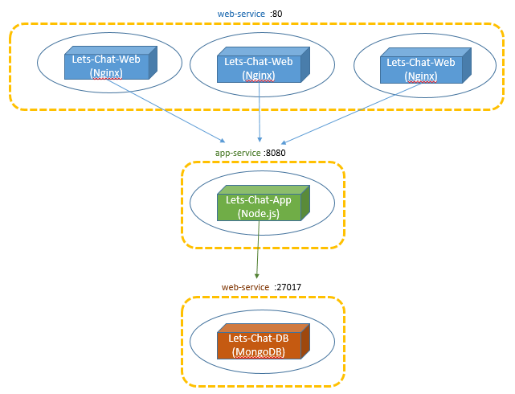

# Task-4: Discover all Lets-Chat microservices

1. Create a Deploy and a Service to Lets-Chat-DB microservice using **kubectl create -f db-deploy.yaml db-svc.yaml** command
  > * You can use bellow [Specifications Examples](#specifications-examples) to define the yaml files
  > * You can use the public latest image. Image name: **mongo**
  > * The MongoDB server is listening on port 27017
  > * Make sure you create ONLY one relica of this pod
  > * The service type of this microservice should not be NodePort - so don't add **type** to yaml
2. Create a Deploy and a Service to Lets-Chat-APP microservice using **kubectl create -f app-deploy.yaml app-svc.yaml** command
  > * The Image name of Lets-Chat-App: **navivi/lets-chat-app:v1**
  > * The App Node.js server is listening on port 8080
  > * You may configure the Lets-Chat-App with the Lets-Chat-DB service-name and port by passing it 2 environment variables: **MONGO_HOST** and **MONGO_PORT**
  > * Make sure you create ONLY one relica of this pod
  > * The service type of this microservice should not be NodePort - so don't add **type** to yaml
3. Update the previous Deploy of Lets-Chat-Web to connect to Lets-Chat-App service using **kubectl apply -f web-deploy.yaml**
  > * You may configure the Lets-Chat-Web with the Lets-Chat-App service-name and port by passing it 2 environment variables: **APP_HOST** and **APP_PORT**
4. Open the service on the Node Port and access the login page. 
  > * Create a user and login. 
  > * Open a different browser and create another user. 
  > * Verfiy you can chat between the users.
  
### Specifications Examples
#### nginx-svc.yaml
```yaml
kind: Service
apiVersion: v1
metadata:
  name: nginx  # The name of your service
spec:
  selector:
    app: nginx  # defines how the Service finds which Pods to target. Should match labels defined in the Pod template
  ports:
  - protocol: TCP
    port: 80 # The service port
    targetPort: 9376 # The pods port
  type: NodePort # [OPTIONAL] If you want ClusterIP you can drop this line 
```
#### nginx-deploy.yaml
```yaml
apiVersion: apps/v1beta2
kind: Deployment
metadata:
  name: nginx-deployment # The name of your deployment
  labels:
    app: nginx  # The label of your deployment
spec:
  replicas: 3 # Number of replicated pods
  selector:
    matchLabels:
      app: nginx # defines how the Deployment finds which Pods to manage. Should match labels defined in the Pod template
  template:
    metadata:
      labels:
        app: nginx # The label of the pod
    spec:
      containers:
      - name: nginx # The container name
        image: nginx:1.7.9 # The DockerHub image
        ports:
        - containerPort: 80 # Open pod port 80 for the container
        env: # [OPTIONAL] add environments values 
        - name: SOME_ENV_NAME
          value: some-env-value
```
